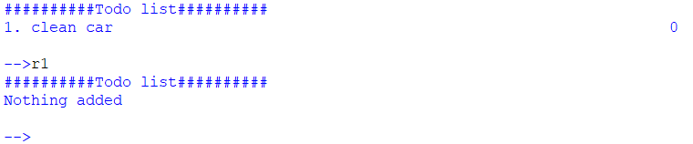
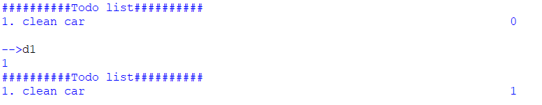
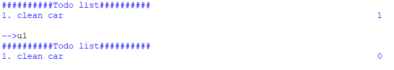

# Python todo list
This is a simple python project to allow me to practise git, planning and documentation. It is a simple todo app inspired by this [video](https://www.youtube.com/watch?v=FCNg8KyMmGI)
## Current Functionality
- Adding tasks to todo list 
  
  
- Removing tasks 
  

- Checking and unchecking tasks 
   
  

## Limitations
- memory is temporary (no file storage)
- UI looks bad and is not clear

## Future plans
- fix limitations
- add a GUI option aswell as command line
- add different user profiles

### Project Timeline

- **04-04-2024**: Made simple CLI app and sorted git
---
- **05-04-2024**: Add permanent memory and refresh button
---
- **06-04-2024**; Add GUI interface for app

