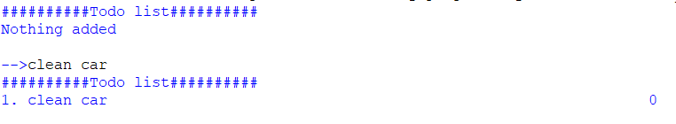

# Python todo list
This is a simple python project to allow me to practise git, planning and documentation. It is a simple todo app inspired by this [video](https://www.youtube.com/watch?v=FCNg8KyMmGI)
## Current Functionality
- Adding tasks to todo list

- Removing tasks
- Checking and unchecking tasks

## Limitations
- memory is temporary (no file storage)
- UI looks bad and is not clear

## Future plans
- fix limitations
- add a GUI option aswell as command line
- add different user profiles

